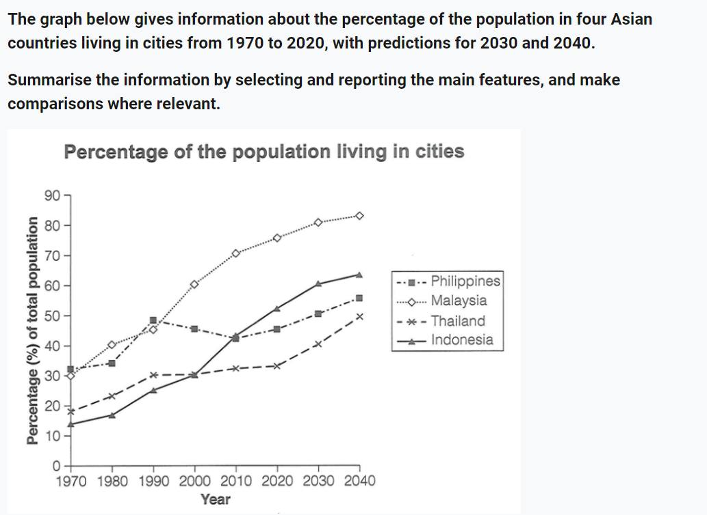
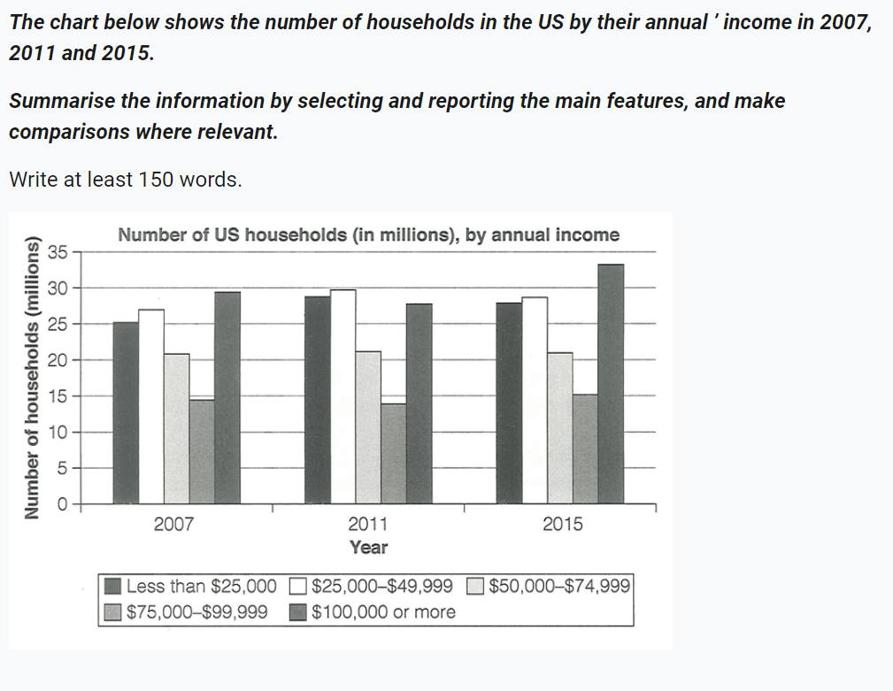
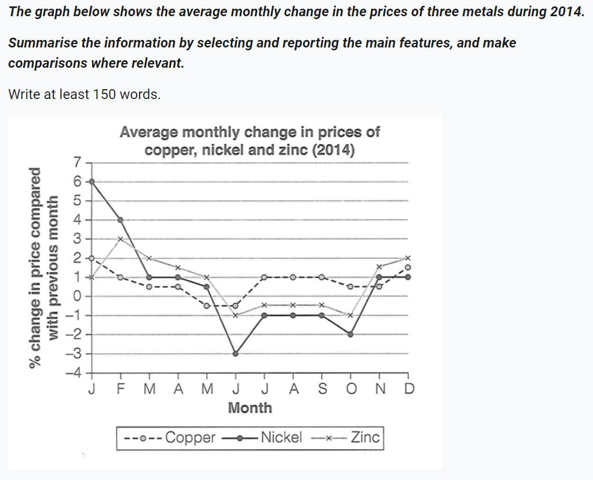

## Cambridge IELTS Vol 18
### Practice Test 1

1. My own response:
<blockquote>
The given line graph highlights how the percentage of the population residing in cities in four different Asian countries - the Philippines, Malaysia, Thailand, and Indonesia - changes for a period of 40 years from 1970 to 2020. The most notable observation from this graph is the increase in the number of city dwellers among these four countries.
</blockquote>

### Practice Test 2

1. My own response:
<blockquote>
The bar graph presents the number of families in the US, categorized by their annual earnings, in three different years: 2007, 2011, and 2015. The data, measured in millions, is divided into five categories. Several trends can be observed from the graph. Firstly, there is a general increase in the earnings of both wealthy and lower-class families, with earnings greater than or equal to $100,000 and less than $25,000 respectively. In contrast, the earnings of middle-class families, with incomes ranging from $25,000 to $99,999, remained unchanged.
</blockquote>

### Practice Test 4

1. My own response:
<blockquote>
The line chart illustrates the changes in the average monthly prices of three metals - copper, nickel, and zinc - over the course of 2014. The most notable observation from the chart is that the price of nickel experienced a significant decrease compared to the other two metals.
</blockquote>

