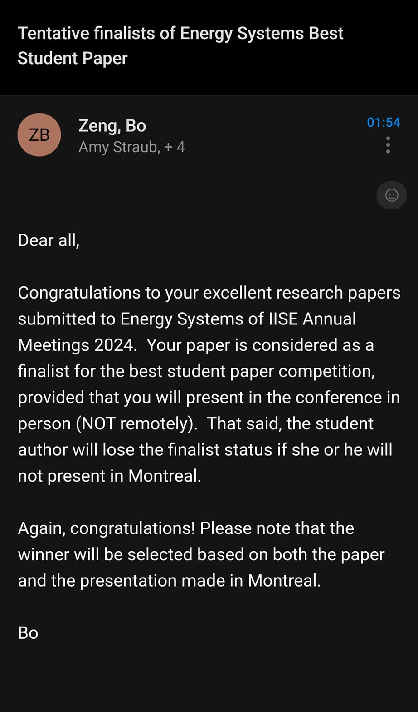
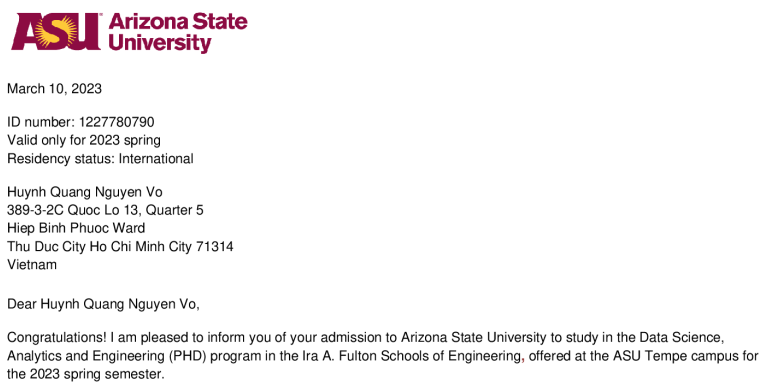
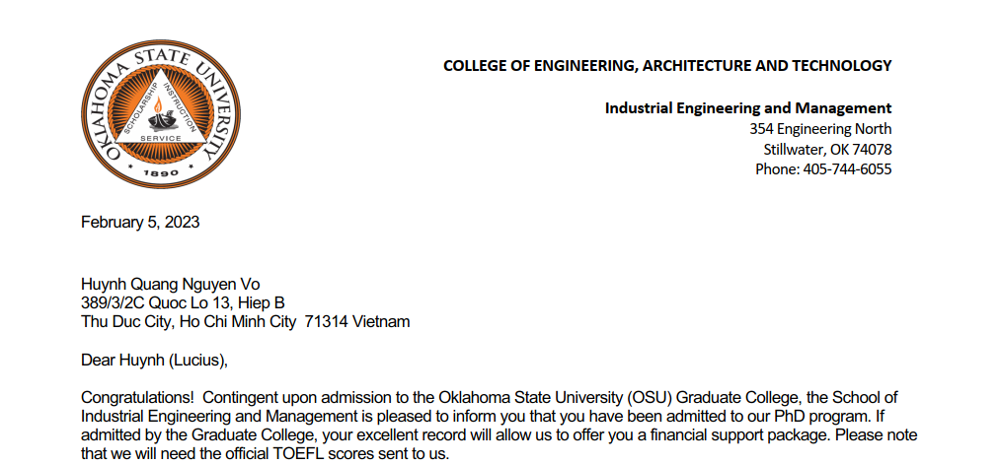
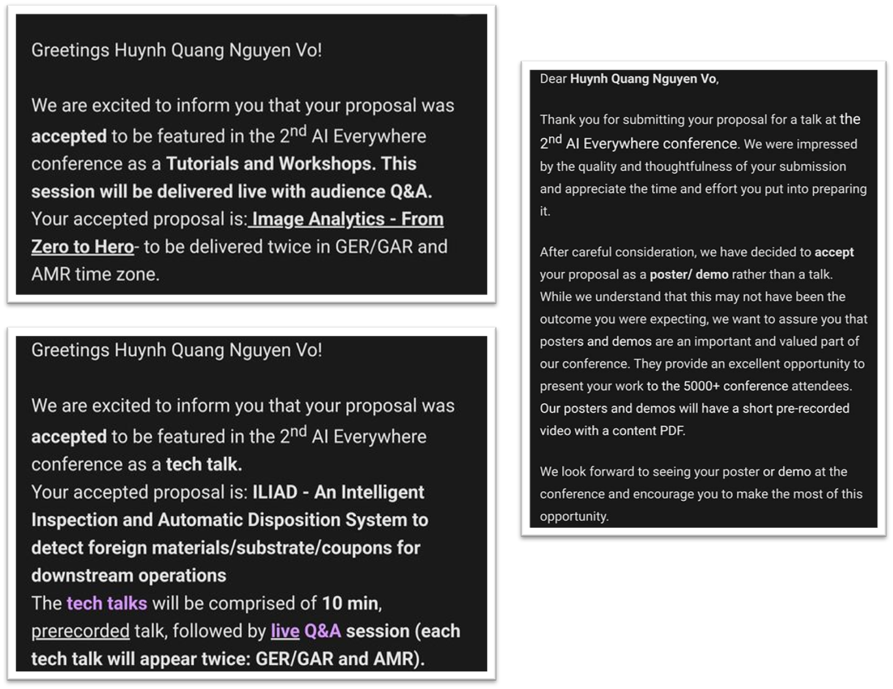

***

**April 10, 2024**: 🌟 Exciting News! 🌟 I'm thrilled to share that our research paper at Distributed Systems Lab (DiSysLab), Oklahoma State Univeristy, has been selected as a finalist in the Energy Systems Best Student Paper competition at the IISE Annual Meetings 2024! I'm looking forward to presenting my paper in Montreal and interacting with fellow researchers and experts in the field.

*Email confirmations of research paper acceptance at the 2024 IISE Annual Meetings.*

***

**April 10, 2024**: Our paper titled "Deep Learning Models for Fault Detection and Diagnosis in Photovoltaic Modules Manufacture" has been accepted at IEEE CAI 2023! 🎉🎉🎉

I'm thrilled to share this milestone and look forward to discussing our findings and networking with peers in the field. 

*Email confirmations of abstract acceptance at the 2023 IEEE CAI.*

***

**August 8, 2023**: Thrilled to announce my engagement to my wonderful long-time girlfriend, now fiancée, Doan! 🎆🎆🎆

***

**July 1, 2023**: Mastering English has its challenges, but I'm here to help! I've shared my journey and tips on learning this fascinating language in a series of bilingual posts. Explore them [here](/posts/2023/07/english-workshop/).

***

**March 15, 2023**: I've documented my journey of applying for a Ph.D. in the US, hoping it serves as a guide or a valuable reference for prospective Ph.D. candidates. Read about my experience [here](/posts/2023/03/phd-application/).

***

**March 13, 2023**: 🌟 Exciting news! 🌟 After a tense wait, I have been admitted to the PhD program in Data Science and Engineering at Arizona State University, Ira A. Fulton School (ASU)!

*Acceptance letter from the Graduate College of ASU.*

***

**February 5, 2023**: I'm pleased to share that I've been admitted to the PhD program in Industrial Engineering and Management at Oklahoma State University, Stillwater (OSU)! 🎆🎆🎆

*Acceptance letter from the Graduate College of OSU.*

***

**January 12, 2023**: In late November 2022, I was invited by Mr. Khuong Nguyen Vinh, an Associate Lecturer at RMIT Vietnam, to deliver a guest lecture on real-world applications of optics and optoelectronics. The lecture was held on January 11, 2023, and the slides are available [here]().

***

**December 26, 2022**: At Intel Corp, the Intel Manufacturing Excellence Conference (IMEC) and the Intel AI Everywhere Conference (IAIEC) are highly prestigious. I'm proud to announce that all three projects I led were accepted at the 2023 IAIEC—an outstanding achievement for both my team and Intel Vietnam! 🍾🍾🍾

*Email confirmations of project acceptance at the 2023 IAIEC.*

***
